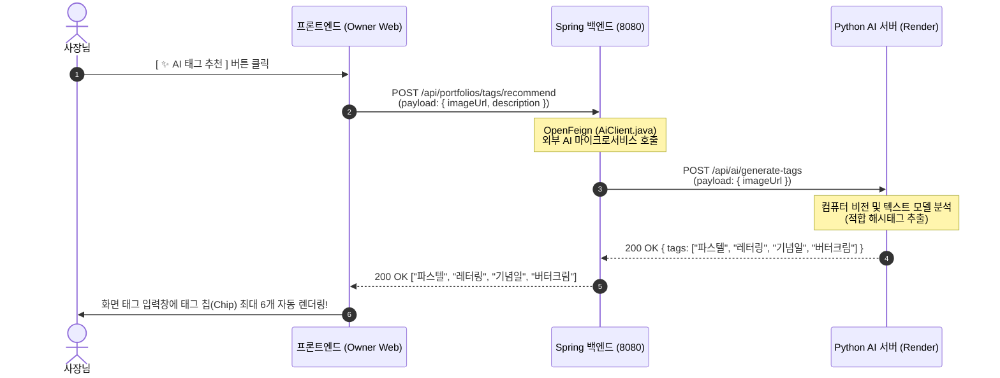
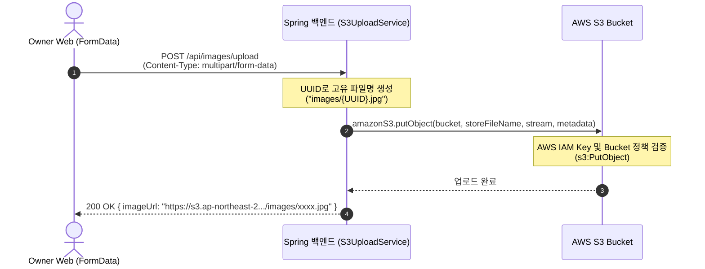

# MakeAWish 사장님 웹앱(Owner Web) 시스템 아키텍처 및 AI 연동 가이드

> **작성일**: 2026-08-02  
> **대상**: MakeAWish 프론트엔드·백엔드·AI 팀 및 프로젝트 포트폴리오 문서  
> **목적**: 프론트엔드(`MakeAWish-FE-Owner`), Spring Boot 백엔드(`MakeAWish-BE`), Python AI 마이크로서비스(`MakeAWish-AI`) 간의 통합 통신 아키텍처, 권한 매핑 설계 및 모범 보안 사례 기록  

---

## 1. 전체 아키텍처 개요 (BFF / Microservice Proxy Pattern)

MakeAWish 사장님 웹 서비스는 프론트엔드가 외부 AI 서버(`Render.com`)를 직접 호출하지 않고, **Spring Boot 백엔드 서버를 BFF(Backend for Frontend) 및 API 게이트웨이 프록시**로 활용하는 마이크로서비스 아키텍처로 설계되어 있습니다.

```mermaid
graph LR
    subgraph FE [Owner Web (React/Vite)]
        UI[사장님 웹 화면]
        Store[Zustand Store]
        ApiClient[Axios Client]
    end

    subgraph BE [Spring Boot Backend (AWS EC2 / EBS)]
        Controller[REST Controller]
        Service[Business Service]
        Feign[Spring Cloud OpenFeign (AiClient)]
        S3Svc[S3UploadService]
        DB[(AWS RDS MySQL)]
    end

    subgraph CLOUD [External Cloud Services]
        AWS_S3[AWS S3 Bucket]
        AI_SRV[Python FastAPI AI Server (Render)]
    end

    UI --> Store --> ApiClient
    ApiClient -- "HTTP REST (/api/*)" --> Controller
    Controller --> Service
    Service -- "JPA / Hibernate" --> DB
    Service -- "OpenFeign Proxy" --> Feign
    Feign -- "POST /api/ai/*" --> AI_SRV
    Service --> S3Svc
    S3Svc -- "PutObject" --> AWS_S3
```

### 아키텍처 설계의 3대 핵심 이점
1. **CORS 및 브라우저 보안 이슈 차단**: 프론트엔드는 단일 백엔드 오리진(`http://...elasticbeanstalk.com`)과만 통신하므로, 외부 AI 서버와의 CORS 설정이나 인증 토큰 관리를 신경 쓸 필요가 없습니다.
2. **보안 키 및 클라우드 자격증명 은닉**: AWS IAM Access Key, S3 Bucket 정보, AI 서버 URL 등 민감한 환경변수는 오직 백엔드 서버(`application.yml`)에만 격리되어 브라우저 노출이 원천 방지됩니다.
3. **데이터 정제 및 예외 통제**: AI 서버의 raw 응답을 백엔드가 1차로 가공하고 유효성을 검증한 뒤 프론트엔드에 깔끔한 JSON(`List<String>`) 형태로 내려줍니다.

---

## 2. (AI) 포트폴리오 태그 추천 작동 매커니즘 (`POST /api/portfolios/tags/recommend`)

사장님이 포트폴리오 사진을 등록할 때, 사진과 설명에 어울리는 케이크 해시태그를 AI가 추천해 주는 기능의 4단계 릴레이 통신 과정입니다.



### 코드 계층별 구현 사양
- **Frontend (`src/api/portfolioApi.js`)**:
  ```javascript
  export async function recommendPortfolioTags({ imageUrl, description }) {
    return client.post('/api/portfolios/tags/recommend', { imageUrl, description })
  }
  ```
- **Backend (`PortfolioService.java` & `AiClient.java`)**:
  - `AiClient` 인터페이스가 Spring Cloud OpenFeign을 활용해 Python AI 서버의 `/api/ai/generate-tags`를 비동기/동기로 호출합니다.

---

## 3. 사장님 회원가입 및 매장 개설 권한 구조 (AS-IS vs TO-BE 정석 아키텍처)

### 3.1. 백엔드 매장 소유주 검증 쿼리 (`StoreRepository.findByUserId`)
백엔드의 모든 매장 관리 기능(추가금 등록, 리뷰 답글 작성 등)은 로그인한 사용자(`User`)가 해당 가게(`Store`)의 실제 주인인지 확인하기 위해 아래 조인 쿼리를 수행합니다.
```sql
SELECT s FROM Store s 
JOIN s.sellerProfile sp 
WHERE sp.user.id = :userId
```
- 즉, **`User(유저 ID)` ➔ `SellerProfile(사장님 프로필)` ➔ `Store(매장)`** 3단 매핑 관계가 DB 상에 존재해야만 `500 Internal Server Error`(`IllegalStateException`)가 발생하지 않습니다.

### 3.2. 구조 개편 비교표 (임시방편 vs 기초 정석 설계)

| 구분 | 🔴 AS-IS (현재 상태 및 문제점) | 🟢 TO-BE (기초부터 개편하는 정석 구조) | ✨ 기대 효과 및 변경 사항 |
| :--- | :--- | :--- | :--- |
| **1. 회원가입 / 로그인<br>(`AuthService.socialLogin`)** | • 구글 로그인 시 오직 `User(ROLE_USER)` 엔티티 1개만 생성됨.<br>• **`SellerProfile` 및 매장(`Store`) 자동 생성 없음.** | • 사장님 앱 가입/로그인 시 **`User(ROLE_SELLER)` + `SellerProfile` + 기본 `Store` 엔티티("임시 매장") 3종을 트랜잭션으로 자동 생성**. | • 가입 즉시 내 가게(`storeId`)를 보유하여 **DB 누락 문제 원천 차단**.<br>• 수동 매핑으로 인한 권한 불일치 영구 방지. |
| **2. 가게 프로필 등록/수정<br>(`PATCH /api/stores/profile`)** | • 계정에 매장이 없어 API 호출 시 `500 Server Error` 터짐. | • 가입 시 생성된 "기본 매장"을 대상으로 호출하여, 사장님이 가게명/영업시간을 정식 등록 및 갱신. | • 별도 가게 생성 API(`POST`) 개발 없이, **매장 관리 페이지(`StoreManage.jsx`)를 정식 개설 페이지로 100% 활용**. |
| **3. 추가금 / 리뷰 답글<br>(`extra-fee` / `reply`)** | • 백엔드의 매장 소유주 검사(`equals(sellerStore.getId())`) 실패 ➔ `500 Server Error` 발생. | • 사장님 계정과 매장 ID가 1:1로 완벽 매핑되어 있으므로 소유주 검증 통과 ➔ **`200 OK` 정상 처리**. | • 어떤 신규 테스트 계정으로 로그인해도 에러 없이 즉시 QA 및 프로덕션 이용 가능. |
| **4. 예외 처리 방식<br>(`@ExceptionHandler`)** | • 매장 누락 시 백엔드가 무조건 `500 Server Error`를 내려 원인 추적이 힘듦. | • 권한 및 매칭 예외 시 **`403 Forbidden`** 또는 **`400 Bad Request`**와 명확한 JSON 안내 메시지 반환. | • 프론트엔드 및 QA 테스트 단계에서 에러 원인 즉시 직관적 식별. |

---

## 4. AWS S3 이미지 업로드 매커니즘 (`POST /api/images/upload`)



### 실서버 에러 체크리스트 (`500 Error` 발생 시)
- [ ] AWS 실서버(Elastic Beanstalk / EC2) 환경변수에 `AWS_ACCESS_KEY_ID`, `AWS_SECRET_ACCESS_KEY`, `CLOUD_AWS_S3_BUCKET` 변수가 정상 주입되었는지 확인.
- [ ] AWS IAM 역할(Role) 또는 사용자 정책에 `s3:PutObject` 권한이 부여되어 있는지 확인.

---

## 5. 프론트엔드 환경변수(`.env`) 및 보안 모범 사례

```env
# =========================================================================
# [MakeAWish-FE-Owner] 프론트엔드 정상 .env 예시
# (주의: 이 파일에는 절대로 AWS Access Key나 Server Secret Key를 기재하지 않습니다!)
# =========================================================================

# 1. API 서버 주소 (공개 정보)
VITE_API_URL=http://make-a-wish-env.eba-dvjn7a8x.ap-northeast-2.elasticbeanstalk.com

# 2. Google OAuth Web Client ID (공개 식별자 - 브라우저 노출 안전)
VITE_GOOGLE_CLIENT_ID=106131390766-mnqk6vkbs4n33s2tt63om1860e6cgaau.apps.googleusercontent.com

# 3. AI 서버 주소
VITE_AI_API_URL=https://makeawish-ai.onrender.com
```

### 보안 상식 요약
- **공개 식별자 (`VITE_GOOGLE_CLIENT_ID`, `VITE_API_URL`)**: 크롬 브라우저 요청 시 주소창에 자연 노출되는 정보이므로 `.env.example`이나 깃허브에 공유되어도 안전합니다.
- **비밀 자격증명 (`AWS_ACCESS_KEY_ID`, `Google Client Secret`, `DB Password`)**: 브라우저에 노출되면 클라우드 무단 사용 위험이 있으므로 **백엔드 서버의 환경변수**에만 작성해야 합니다.
